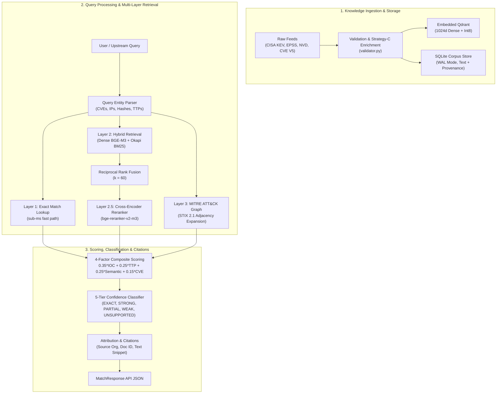

# Architecture: Threat Retrieval & Matching Subsystem

## 🏗️ System Overview

The **Threat Retrieval & Matching Subsystem** is an enterprise-grade cyber threat intelligence (CTI) search, retrieval, and matching pipeline. It bridges incoming threat observations (IOCs, CVEs, malware, tactics, and unstructured logs) with a historical knowledge base of 362,000+ vulnerability and threat intelligence records.

---

## 🔍 Retrieval Architecture: The 3 Search Engines

### 1. Engine 1: Technical IOC Exact Lookup (`exact_lookup.py`)
- **Latency**: `< 1 ms`
- **Mechanism**: Direct index lookup in SQLite (`doc_id`, `chunk_id`) and Qdrant keyword payload index (`cves`, `source_org`, `threat_actors`).
- **Purpose**: Immediate sub-millisecond resolution when a direct CVE ID, IP, or hash is present in the query.

### 2. Engine 2: Vector Hybrid Search (`hybrid_search.py`)
- **Latency**: `~100–150 ms`
- **Dense Vector**: `BAAI/bge-m3` produces 1024-dimensional dense vectors with L2 normalization and Int8 scalar quantization.
- **Lexical Search**: In-memory Okapi BM25 index with a cyber-aware tokenizer preserving technical tokens (`CVE-2017-0144`, `198.51.100.24`, `T1021.002`).
- **Fusion**: Reciprocal Rank Fusion ($RRF(d) = \sum \frac{1}{60 + \text{rank}(d)}$) to merge non-calibrated ranking scores without arbitrary weights.
- **Reranker**: Optional cross-encoder (`BAAI/bge-reranker-v2-m3`) for high-fidelity top-5 reranking.

### 3. Engine 3: MITRE ATT&CK Knowledge Graph (`mitre_graph.py`)
- **Latency**: `~10–30 ms`
- **Structure**: In-memory directed adjacency graph built from MITRE ATT&CK Enterprise STIX 2.1 bundles.
- **Purpose**: Graph expansion linking threat actors to techniques and malware (e.g. `APT29 -[uses]-> T1021.002 -[implemented-by]-> PsExec`), providing explainability and semantic threat linkage.

---

## 🧮 4-Factor Composite Scoring & 5-Tier Classification

Candidates are scored using a weighted multi-factor formula:

$$\text{Composite Score} = 0.35 \times S_{\text{IOC}} + 0.25 \times S_{\text{TTP}} + 0.25 \times S_{\text{Semantic}} + 0.15 \times S_{\text{CVE}}$$

| Confidence Tier | Score Range | Operational Meaning |
| :--- | :--- | :--- |
| **`EXACT`** | $\ge 0.95$ | Direct technical identifier and behavioral match |
| **`STRONG`** | $0.80 - 0.94$ | Multi-signal match with high semantic alignment |
| **`PARTIAL`** | $0.55 - 0.79$ | Partial overlap (e.g. shared technique or malware family) |
| **`WEAK`** | $0.30 - 0.54$ | Low semantic similarity or incidental keyword mention |
| **`UNSUPPORTED`** | $< 0.30$ | No relevant correlation / benign non-threat query |

---

## 📦 Storage Footprint

- **SQLite Database** (`data/sqlite/corpus_store.db`): 517 MB in WAL mode storing 362,301 documents with complete text, provenance, and extracted entity JSON.
- **Qdrant Storage** (`data/qdrant_storage/`): 4.2 GB embedded local storage with Int8 quantization and payload indices on `source_org`, `severity`, `cves`, `mitre_ttps`, and `threat_actors`.
